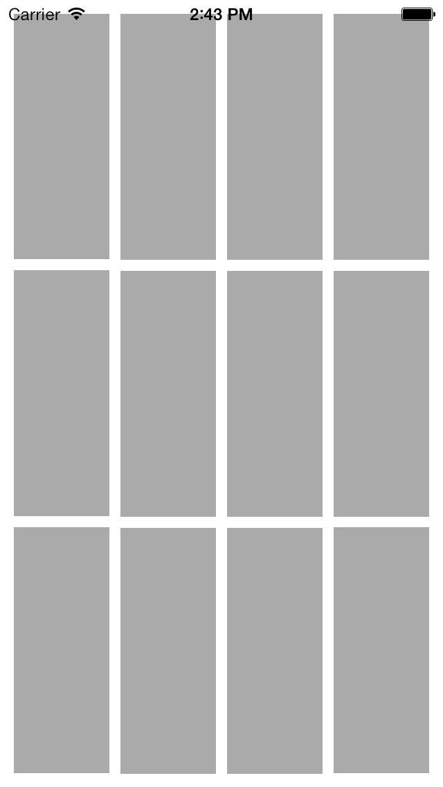
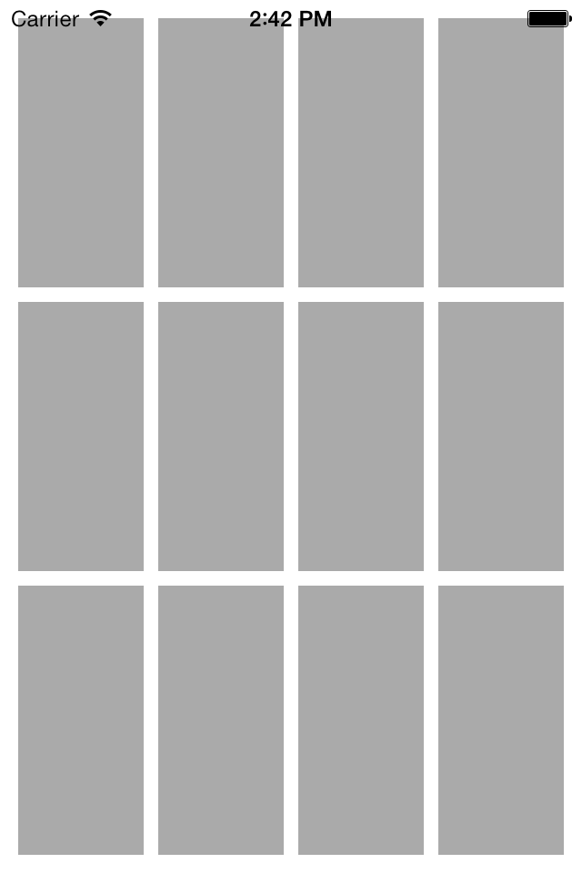
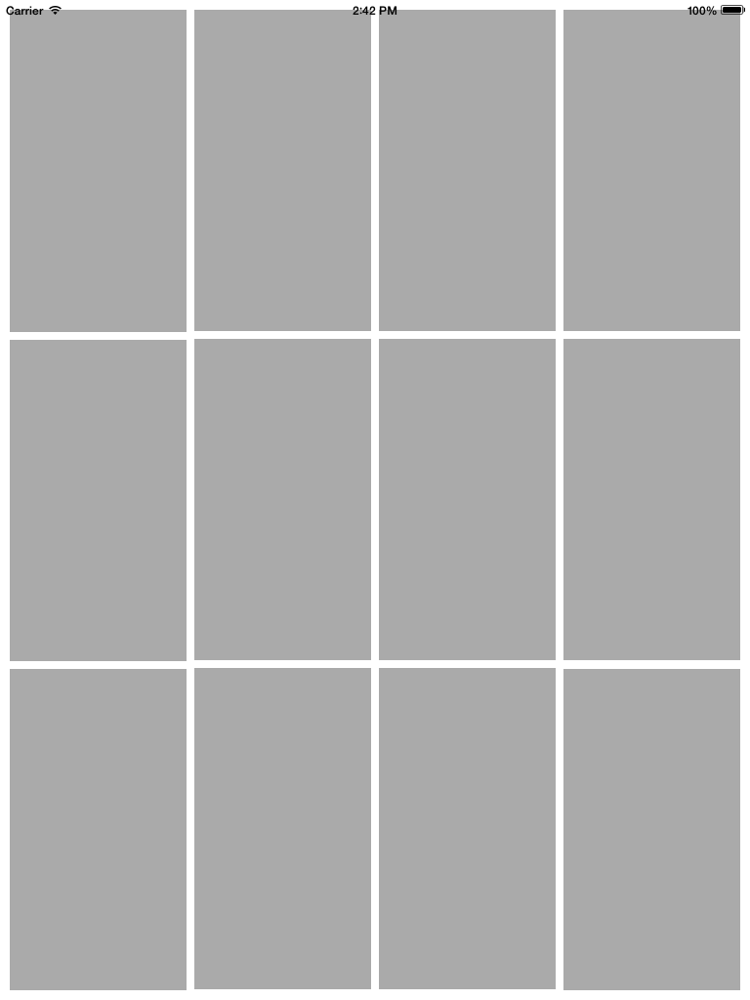

giant-robot-autogrid
====================

#Description

This is a sample iOS grid-based autolayout project. The grid can be used to set up interfaces that will size and expand to all screen sizes using autolayout. This AutoGrid is set up for a 4x3 grid with 10px padding between the UIViews.

---

#Screenshots

##iPhone 4 in.

##iPhone 3.5 in.

##iPad

